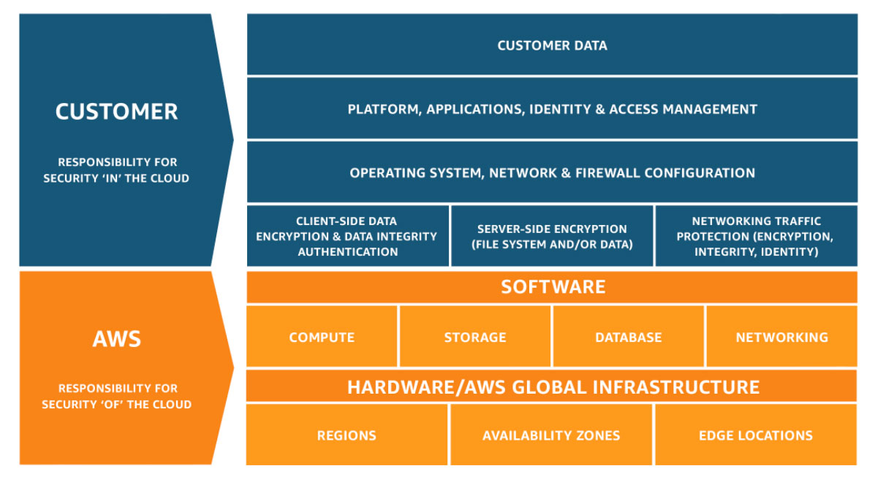

# AWS Notes

## Three Fundamentals of AWS

1. Compute
2. Storage
3. Outbound Data Transfer

## Traditional IT and Cloud Computing

* Traditional
    * Requires human involvement
    * Internal accessibility, limited public presence
    * Single-tenant, can be virtualized
    * Limited scalability
    * Usage is not typically measured
* Cloud
    * On-demand - self service
    * Broad network access
    * Resource pooling
    * Rapid Elasticity
    * Measured Service

## Cloud Service and Deployment Models

* Service Models
    * Private
        * You own the whole stack including hardware
    * Infrastructure as a Service (IaaS)
        * Not responsible for the underlying hardware
        * Responsible for everything else including OS
        * EC2, Azure VM, Google Compute Engine
    * Platform as a Service (PaaS)
        * Only responsible for the application and data
        * Uploading code and data
        * AWS Elastic Beanstalk, Azure Web Apps, Google Compute Engine
    * Software as a Service (SaaS)
        * You don't manage anything
        * Just using service only
        * Salesforce, Google Apps, Zoom

* Deployment Models
    * Private Cloud
        * Full control, including security
        * VMware, Microsoft, RedHat, OpenStack
    * Public Cloud
        * Variable expenses
        * Economies of scale
        * Massive elasticity
        * AWS, Azure, Google Cloud Platform
    * Hybrid Cloud
        * Mix of private and public cloud
    * Multi Cloud
        * Using multiple cloud providers and private

## AWS Global Infrastrcture

* Region
    * A physical location in the world that is independent
    * Interconnected with other regions with AWS's own high bandwidth network
    * Each regions has two or more availability zones
    * Isolated from other regions
* Availability Zone
    * Composed on one or more data centers inside a region
    * Provide redundancy within a region
    * Subnets are created within the AZ (VPN)
    * Physically separated and isolated from other AZs
* AWS Outposts
    * Hardware from AWS that you can deploy at your company
* AWS Local Zone
    * Can deploy own applications and can deploy to reduce latency
    * Place compute, stoage, database, and other select services closer to end-users
    * Exentsion of the AWS Region
* AWS Wavelength
    * 5G connectivity
* CloudFront Origins
    * Get content geographically closet to users
    * Regional edge cache
    * Edge cache
* Edge Locations and Regional Edge Caches
    * Edge locations are Content Delivery Network (CDN) endpoints for CloudFront
    * Many more edge locations that regions
    * Regional edge caches sit between your CloudFront Origin servers and edge locations
    * Regional edge caches has a larger cache0width than each of the individual edge locations

## AWS Shared Responsibility Model

* AWS is responsible for the "Security OF the Cloud"
* Customer is responsible for the "Security IN the Cloud"

## Launching Cloud Services

* Three ways:
    * AWS Management Console
    * Console
    * SDK

## AWS Public and Private Services

* Public
    * Accessible via the Internet
    * Amazon DynamoDB
    * Amazon S3
    * Amazon Route 53
    * Amazon CloundFront
* Private
    * Not accessible via the Internet (can be though)
    * VPCs
    * EC2 Instance
    * Amazon RDS
    * Amazon Elastic File System

## Six Advantages of Cloud Computing

1. Trade capital expense (CAPEX) for variable expense (OPEX)
    * OPEX is tax deductable per hear while CAPAX is spread across years
2. Benefit from massive economies of scale
3. Stop guessing capacity
4. Increase speed and agility
    * Speed means to deploy resources easily and quickly
    * Agility means to react to change; speed to market
5. Stop spending money running and maintaining data centers
6. Go global in minutes

## AWS Identity and Access Management (IAM)

* Global in scope

*Read the article by AWS*

## References

* [AWS Cloud Computing Concepts](https://digitalcloud.training/aws-cloud-computing-concepts/)
* [AWS Glbal Infrastructure](https://digitalcloud.training/aws-global-infrastructure/)
* [AWS Billing and Pricing](https://digitalcloud.training/aws-billing-and-pricing/)