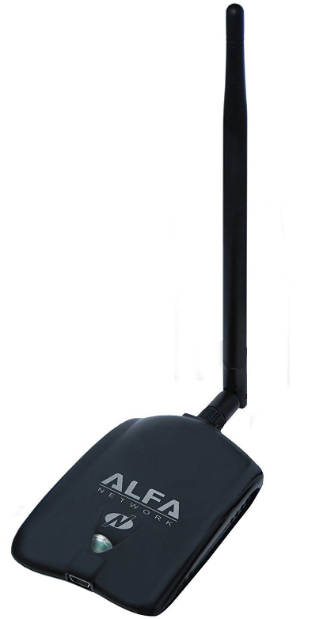
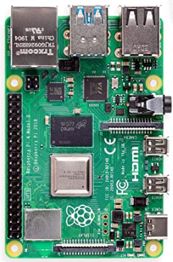

# OSWP - Equipment

The OSWP course provides a lab environment for the test only. It does not provide one when preparing for the exam. It was a challenge to find a router that still supports WEP (which is actually a good thing). Even going on E-bay and purchasing an older model proved to be fruitless since firmware/software updates will remove the WEP option. The latest study material for the exam does not cover WEP so it is likely that it won't be on the test. Still it is good to prepare just in case.

## Access Points

### TL-WR902AC AC750 Wireless Travel Router

* TP-LINK TL-WR902AC AC750 Wireless Travel Router
* Supports everything and can be used for day-to-day modern connectivity too


## Wireless Adapters

### ALFA AWUS036NH

* ALFA AWUS036NHA 802.11n Wireless-N Wi-Fi USB Adapter High Speed Atheros AR9271 (x2)
    * Only one is required but bought two to do some other things
    * Purchased on Ebay at a cheaper price than Amazon



#### Driver Installation

```bash
sudo apt update
sudo apt upgrade -y
sudo apt dist-upgrade -y
sudo reboot now

sudo apt-get install -y linux-headers-$(uname -r)
sudo apt-get install -y realtek-rtl88xxau-dkms dkms
git clone https://github.com/aircrack-ng/rtl8812au
cd rtl8812au
make
sudo make install
```

#### Troubleshooting

If the device becomes unresponsive and this seems to happen when plugged in for long periods of time then unplug the device and restart the VM. If the light is green and never shows blue then there is a problem. Try standing on your head. Once the VM starts, plug the device in again. The light should toggle to blue from time-to-time.

## Clients/Stations

Anything with Wi-Fi capabilities will do. The Raspberry Pi 4 below is a bit of overkill.

### Raspberry Pi 4

* [Raspberry Pi 4 Model B](https://www.amazon.com/CanaKit-Raspberry-8GB-Extreme-Kit/dp/B08B6F1FV5?th=1)
* 8GB RAM
* Samsung EVO+ 128GB MicroSD Pre-loaded with NOOBS
* CanaKit Premium Black Case (High Gloss)
* CanaKit USB-C Power Supply
* Set of 2 Micro HDMI Cables
* USB Card Reader
* CanaKit Quick-Start Guide
* CanaKit GPIO Reference Card

