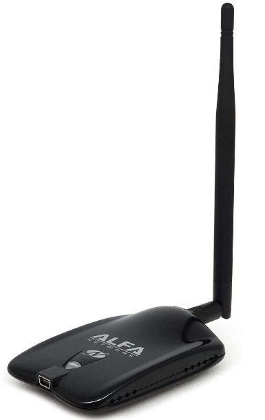

# OSWP - Hardware

## Setup

The OSWP course does not provide a lab environment except for the exam. Here is what is can be used to build a home lab.:

* VMware image of Kali Linux
* Access point (AP) that supports WEP/WPA/WPA2
     * A pin to factory reset it
* One or two wireless adapters that support monitor mode
* Any client with Wi-Fi capabilities


* Note that the green stress ball is optional


## Access Points

Finding a router with WEP capabilities is not easy these days and that is a good thing. Even old and used routers have updated firmware/software that lacks the WEP capability. It doesn't appear the new exam tests for WEP but not 100% sure. It's good to learn how to either way.

### TP-Link AC750 (TL-WR902AC)

Best one. It's modern and still offers WEP/WPA/WPA2/WPA3 capabilities out of the box.

| Name      | Value                                                                                                                                |
|-----------|--------------------------------------------------------------------------------------------------------------------------------------|
| Model     | [TP-Link AC750 Wireless Portable Nano Travel Router (TL-WR902AC)](https://www.tp-link.com/us/home-networking/wifi-router/tl-wr902ac) |
| Docs      | [User Guide](https://static.tp-link.com/2019/201906/20190624/1910012191_TL-WR902AC%203.0_UG_REV3.0.0.pdf)                            |
| Specs     | IEEE 802.11n/b/g 2.4 GHz, IEEE 802.11ac/n/a 5 GHz                                                                                    |
| Power     | 20-23 dBm                                                                                                                            |
| SSIDs     | TP-Link_18-E1, TP-Link_18E1_5G                                                                                                       |
| CREDS     | admin:admin                                                                                                                          |
| IP        | http://192.168.0.1 / http://tplinkwifi.net                                                                                           |
| Security  | WEP/WPA/WPA2                                                                                                                         |
| HVIN      | HVIN:TL-WR902AC V3                                                                                                                   |


#### Configuration

* Connect to the AP using the PIN credentials found on the device via your computer's wi-fi
* Open a browser and navigate to [http://192.168.0.1](http://192.168.0.1) via a browser
* Disable WPS (You will need to do this or the choose  WEP option will not appear)
  * Go to `Wireless 2.4 GHz -> WPS`
  * Click on the `Disable` button


  * Wait for the router to reboot. It will happen automatically without a prompt. You may need to reconnect/reauthenticate with the PIN if you did not select `Connect automatically`
* Verify that WPS is disabled


* Go to `Wireless 2.4GHz -> Wireless Security`
* Select the `WEP` option


* Set WEP key  accordingly
  * 64-bit: Enter 10 hexadecimal digits (any combination of 0-9, a-f, A-F, zero key is not permitted) or 5 ASCII characters.
  * 128-bit: Enter 26 hexadecimal digits (any combination of 0-9, a-f, A-F, zero key is not permitted) or 13 ASCII characters.
  * 152-bit: Enter 32 hexadecimal digits (any combination of 0-9, a-f, A-F, zero key is not permitted) or 16 ASCII characters.


## Wireless Adapters

### ALFA AWUS036NHA

Only one is needed but having two is nice to have for creating a secondary access point and adapter to adapter injection testing.

| Name (A1)    | Value                                                                                        |
|--------------|----------------------------------------------------------------------------------------------|
| Model        | [ALFA AWUS036NHA](https://www.amazon.com/Alfa-AWUS036NHA-Wireless-USB-Adaptor/dp/B004Y6MIXS) |
| Chipset      | Atheros AR9271                                                                               |
| Frequency    | 2.GHz                                                                                        |
| Spec         | IEEE 802.11 b/g/n                                                                            |
| Power        | 5 dBi                                                                                        |
| Linux Driver | [https://github.com/aircrack-ng/rtl8812au](https://github.com/aircrack-ng/rtl8812au)         |



#### Driver Installation

```bash
sudo apt update
sudo apt upgrade -y
sudo apt dist-upgrade -y
sudo reboot now

sudo apt-get install -y linux-headers-$(uname -r)
sudo apt-get install -y realtek-rtl88xxau-dkms dkms
git clone https://github.com/aircrack-ng/rtl8812au
cd rtl8812au
make
sudo make install
```

#### Troubleshooting

Sometimes the device becomes unresponsive when connected to a VM over long periods of inactivity. Unplug the device and restart the VM. The green light should start to flash blue.

## Clients/Stations

Anything with Wi-Fi capabilities will do with a few caveats:

* WEP - Some devices might not support it anymore.
* Don't wire your device to your normal LAN in case it gets attacked not by you.

### Raspberry Pi (Wi-Fi)

A Raspberry Pi with Wi-Fi capabilities is a great client to attack when connected to a target AP.

* An old Raspberry Pi Model B worked just fine

```bash
cat /proc/cpuinfo
```


* Connect a Wi-Fi USB adapter if Wi-Fi is not already on board
* Make note of the Wi-Fi BSSID with the `ifconfig` or `ip -a` command
* Connect to the vulnerable AP with weak password


