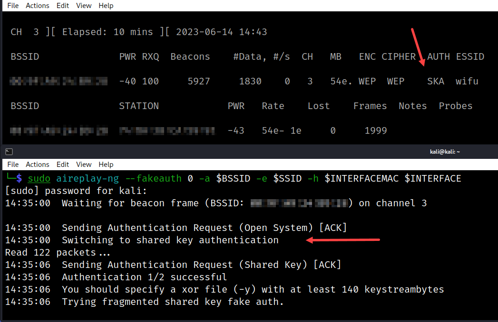

# Shared Key Authentication (SKA)

How to tell if AP is using `Shared Key Authentication`.

```bash
[TERMINAL ONE]
# Set interface to monitor mode
sudo airmon-ng start $INTERFACE $CHANNEL

# Start monitoring to collect data
sudo airodump-ng -c $CHANNEL --bssid $BSSID -w $TAG $INTERFACE

[TERMINAL TWO]
sudo aireplay-ng --fakeauth 0 -a $BSSID -e $SSID -h $INTERFACEMAC $INTERFACE
```
* Look for the `Switching to shared key authentication` message
* Look for the `SKA` under `AUTH` in the `airodump-ng` window too


