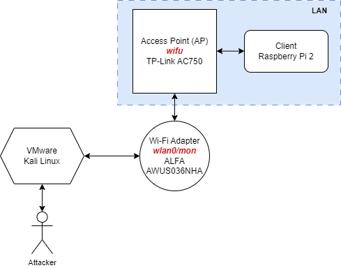
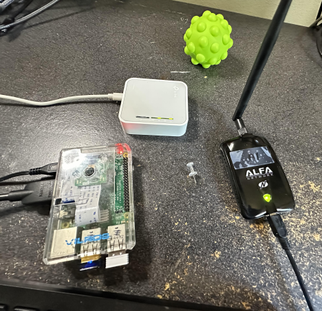
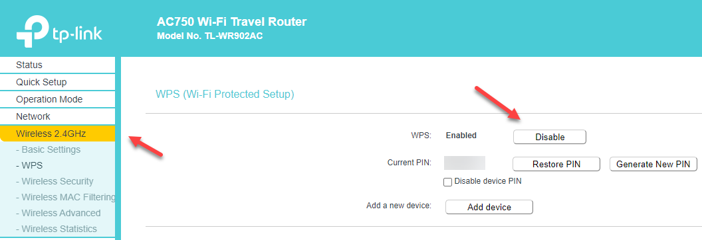
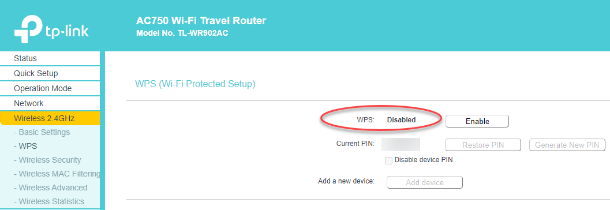
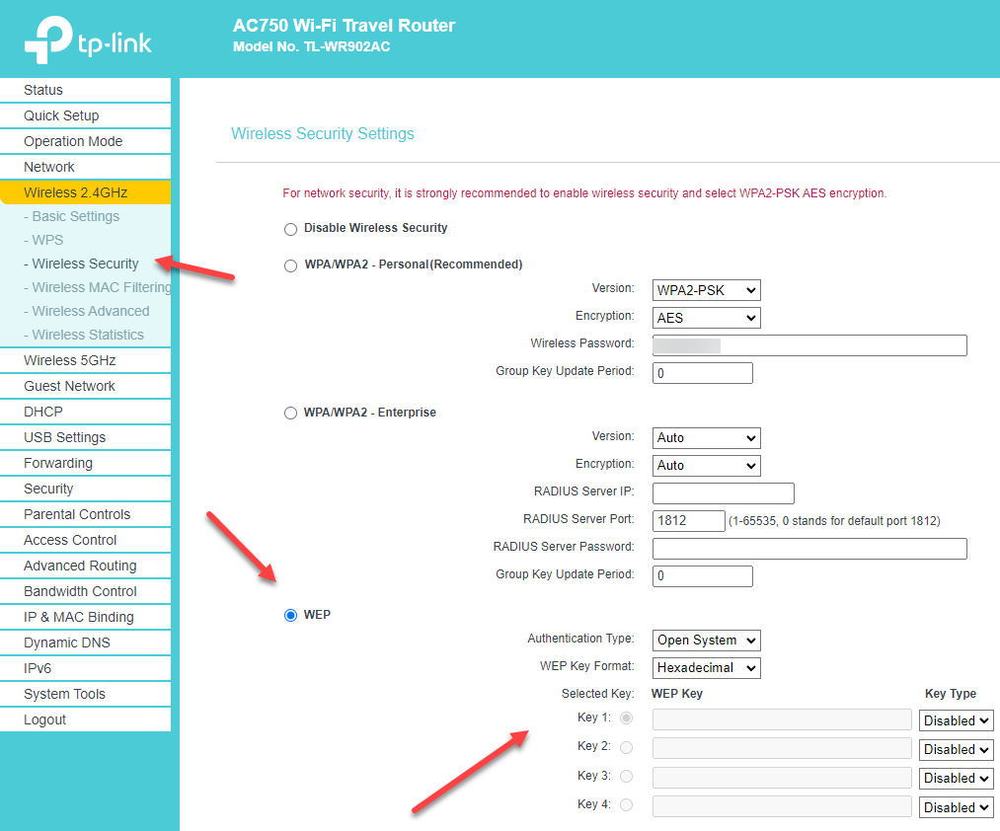
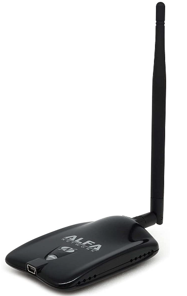
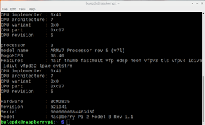
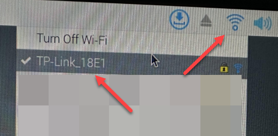

# Hardware

## Setup

Here is a recommended homte lab environment:

* VMware image of Kali Linux
* Access point (AP) that supports WEP/WPA/WPA2
     * A pin to factory reset it
* One or two wireless adapters that support monitor mode
* Any client with Wi-Fi capabilities



* Note that the green stress ball is optional



## Access Points

Finding a router with WEP capabilities is not easy these days and that is a good thing. Even old and used routers have updated firmware/software that lacks the WEP capability. It doesn't appear the new exam tests for WEP but not 100% sure. It's good to learn how to either way.

***Note: Check for old ISP routers to save money if still around at home. Most support WEP/WPA/WPA2.***

### TP-Link AC750 (TL-WR902AC)

Best one. It's modern and still offers WEP/WPA/WPA2/WPA3 capabilities out of the box.

| Name      | Value                                                                                                                                |
|-----------|--------------------------------------------------------------------------------------------------------------------------------------|
| Model     | [TP-Link AC750 Wireless Portable Nano Travel Router (TL-WR902AC)](https://www.tp-link.com/us/home-networking/wifi-router/tl-wr902ac) |
| Docs      | [User Guide](https://static.tp-link.com/2019/201906/20190624/1910012191_TL-WR902AC%203.0_UG_REV3.0.0.pdf)                            |
| Specs     | IEEE 802.11n/b/g 2.4 GHz, IEEE 802.11ac/n/a 5 GHz                                                                                    |
| Power     | 20-23 dBm                                                                                                                            |
| SSIDs     | TP-Link_18-E1, TP-Link_18E1_5G                                                                                                       |
| IP        | http://192.168.0.1 / http://tplinkwifi.net                                                                                           |
| Security  | WEP/WPA/WPA2                                                                                                                         |
| HVIN      | HVIN:TL-WR902AC V3                                                                                                                   |


#### Configuration

* Connect to the AP using the PIN credentials found on the device via your computer's Wi-Fi
* Open a browser and navigate to [http://192.168.0.1](http://192.168.0.1) via a browser
* Change SSID to `wifu` under `Wireless 2.4Ghz -> Basic Settings -> Wireless Network Name`
* Disable WPS (You will need to do this or the choose  WEP option will not appear)
  * Go to `Wireless 2.4 GHz -> WPS`
  * Click on the `Disable` button



  * Wait for the router to reboot. It will happen automatically without a prompt. You may need to reconnect/reauthenticate with the PIN if you did not select `Connect automatically`
* Verify that WPS is disabled



* Go to `Wireless 2.4GHz -> Wireless Security`
* Select the `WEP` option



* Set WEP key  accordingly
  * 64-bit: Enter 10 hexadecimal digits (any combination of 0-9, a-f, A-F, zero key is not permitted) or 5 ASCII characters, e.g., `aabbccddee` or `pizza`
  * 128-bit: Enter 26 hexadecimal digits (any combination of 0-9, a-f, A-F, zero key is not permitted) or 13 ASCII characters.
  * 152-bit: Enter 32 hexadecimal digits (any combination of 0-9, a-f, A-F, zero key is not permitted) or 16 ASCII characters.


## Wireless Adapters

### ALFA AWUS036NHA

Only one is needed but having two is nice to have for creating a secondary access point and for doing advanced adapter to adapter injection testing using `aireplay-ng --test ...`.

| Name (A1)    | Value                                                                                        |
|--------------|----------------------------------------------------------------------------------------------|
| Model        | [ALFA AWUS036NHA](https://www.amazon.com/Alfa-AWUS036NHA-Wireless-USB-Adaptor/dp/B004Y6MIXS) |
| Chipset      | Atheros AR9271                                                                               |
| Frequency    | 2.GHz                                                                                        |
| Spec         | IEEE 802.11 b/g/n                                                                            |
| Power        | 5 dBi                                                                                        |
| Linux Driver | [https://github.com/aircrack-ng/rtl8812au](https://github.com/aircrack-ng/rtl8812au)         |



#### Driver Installation

```bash
sudo apt update
sudo apt upgrade -y
sudo apt dist-upgrade -y
sudo reboot now

sudo apt-get install -y linux-headers-$(uname -r)
sudo apt-get install -y realtek-rtl88xxau-dkms dkms
git clone https://github.com/aircrack-ng/rtl8812au
cd rtl8812au
make
sudo make install
```

#### Troubleshooting

* Testing is done in a Kali Linux VM. Start the VM then connect the adapter. Wait for the prompt from the VM software asking whether to connect to the host or guest. Choose the latter. Do this for each adapter. Starting the VM with the adapter connect does not always work. Sometimes a full host reboot is required (see below) if this doesn't work.
* Sometimes the device becomes unresponsive when connected to a VM over long periods of inactivity. Unplug the device and restart the VM. The green light should start to flash blue.

## Clients/Stations

Anything with Wi-Fi capabilities will do with a few caveats:

* WEP - Some devices might not support it anymore.
* Don't wire your device to your normal LAN in case it gets attacked not by you.

### Raspberry Pi (Wi-Fi)

A Raspberry Pi with Wi-Fi capabilities is a great client to attack when connected to a target AP.

* An old Raspberry Pi Model B worked just fine

```bash
cat /proc/cpuinfo
```


* Connect a Wi-Fi USB adapter if Wi-Fi is not already on board
* Make note of the Wi-Fi BSSID with the `ifconfig` or `ip -a` command
* Connect to the vulnerable AP with weak password


