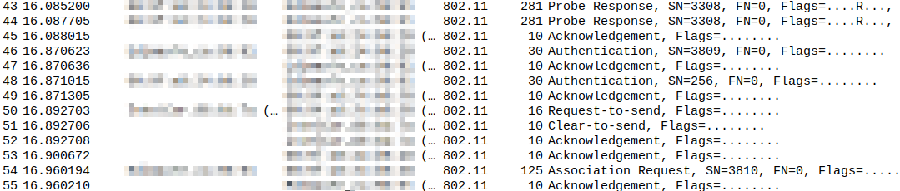
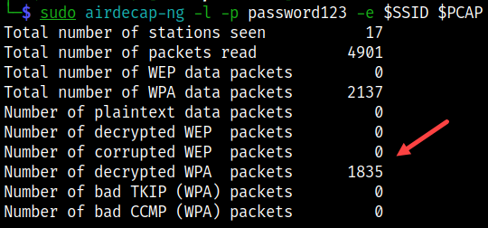
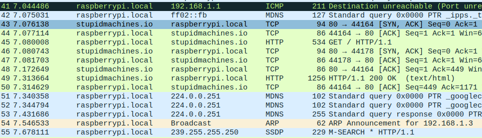

# airdecap-ng

Decrypts WEP/WPA/WPA2 capture files and can be used to filter for a specific BSSID.

## Commands

* Run [setup](../setup.md) first

```bash
# Set interface to monitor mode
sudo airmon-ng start $ADAPTER $CHANNEL

# Start monitoring to collect data
sudo airodump-ng -c $CHANNEL --bssid $BSSID -w $TAG $INTERFACE

# Connect a few clients and do some HTTP via browser

# Stop
qq

# Look at encrypted data in wireshark
sudo wireshark $PCAP
```



```bash
# Decrypt with cracked key (already known)
sudo airdecap-ng -l -p password123 -e $SSID $PCAP
```



```bash
# Look at the decrypted data
sudo wireshark $TAG-01-dec.cap
```



```bash
# Strip headers from unencrypted capture
sudo airdecap-ng -b $BSSID $PCAP

# Look at the much smaller file
sudo wireshark $PCAP
```

## References

* [Airodecap-ng](https://www.aircrack-ng.org/doku.php?id=airdecap-ng)